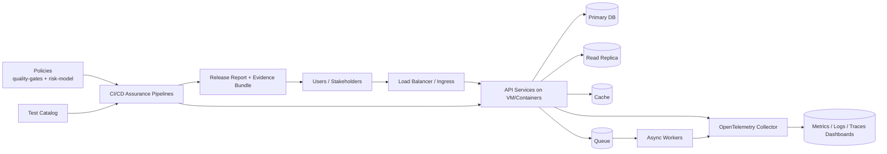

# Unified Assurance Platform (UAP)

A production-ready starter repository for building a **Unified Assurance Platform**: one place to define quality gates, risk policy, test catalogs, CI templates, observability hooks, and release evidence.

## Vision
Ship faster with confidence by making quality decisions:
- **Policy-driven** (quality gates + risk model)
- **Automated** (CI templates + executable scripts)
- **Auditable** (evidence collection + release reports)
- **Pragmatic** (works for API, web, event-driven, and auth/payments flows)

## Architecture (v1)
1. **Policy layer**: `policies/quality-gates.yaml`, `policies/risk-model.yaml`
2. **Execution layer**: `scripts/run-assurance.sh`, CI templates in `ci/templates/github-actions/`
3. **Evidence + reporting**: `scripts/collect-evidence.sh`, `scripts/generate-release-report.py`, `reporting/`
4. **Telemetry layer**: `observability/otel-collector-config.yaml`, dashboard guidance
5. **Domain onboarding**: golden paths and sample service descriptors in `docs/golden-paths/` and `examples/services/`

### Architecture diagram


Detailed architecture: `docs/architecture.md` and `docs/reference-architecture/diagram.md`

## Quick start
```bash
make bootstrap
make validate
make run-assurance
make report RESULTS=examples/results/sample-results.json OUT=examples/results/sample-report.md
```

## Start Here (Non-QE)
If you are new to Quality Engineering, read these first:
- `docs/qe-primer.md` — plain-English QE basics, test types, and anti-patterns
- `docs/methodology-map.md` — how shift-left, risk-based testing, gates, CI/CD, and observability fit together
- `docs/roles-and-consumption.md` — what each stakeholder role should read and do
- `docs/demo-walkthrough.md` — 10-minute walkthrough for happy vs broken release scenarios
- `demo/README.md` — runnable local demo quickstart

Artifacts created in:
- `artifacts/latest/` (run outputs)
- `evidence/<timestamp>/` (auditable bundle)

## New Golden Path: Enterprise Reference Architecture
For teams deploying transaction platforms with LB + API + VM + DB + queue/cache.

Quick links:
- `docs/reference-architecture/overview.md`
- `docs/reference-architecture/diagram.md`
- `docs/reference-architecture/component-contracts.md`
- `docs/golden-paths/reference-architecture.md`
- `ci/templates/github-actions/reference-architecture.yml`
- `demo/reference-scenarios.md`
- `reporting/reference-architecture-scorecard.md`

## Repo map
- `docs/` product + technical guidance
- `policies/` release gates and risk scoring
- `catalog/` test inventory by category
- `ci/templates/github-actions/` reusable pipeline templates
- `observability/` OpenTelemetry starter config and dashboard contract
- `reporting/` KPI and audit formats
- `scripts/` executable assurance orchestration

## Intended consumers
- Engineering teams adopting a standard quality baseline
- QE/Platform teams building centralized assurance workflows
- Product/security/compliance stakeholders requiring clear release decisions

## Contribution standard
For major design docs and stakeholder-facing reports, follow:
- `docs/contribution-standard.md`
- `templates/self-reflection-template.md` (required self-reflection block)

## Agentic-QE enterprise alignment
- `docs/agentic-alignment-matrix.md`
- `docs/enterprise-hardening-backlog.md`
