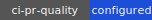
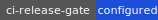
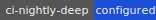
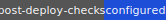
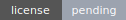
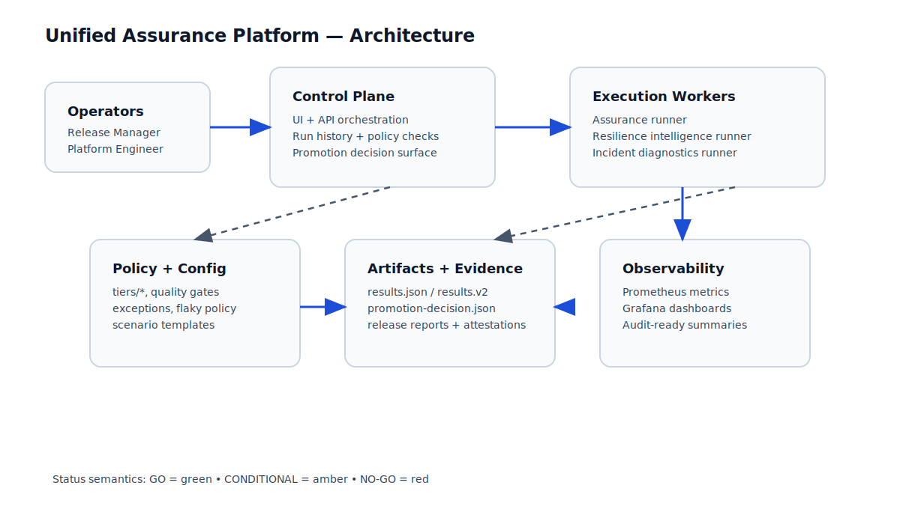
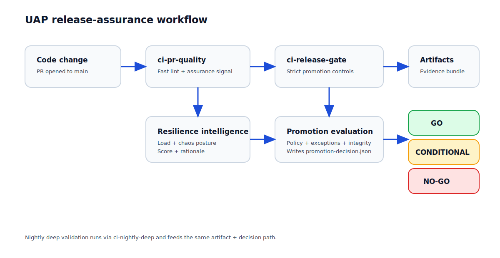
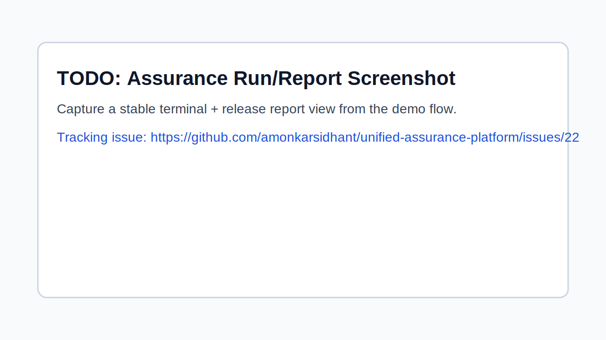
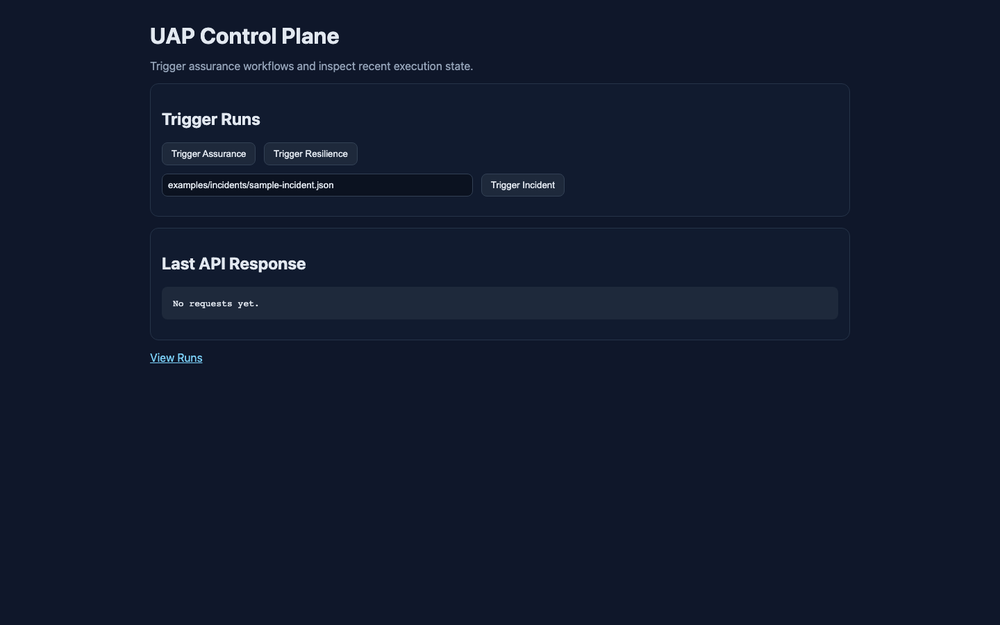

# Unified Assurance Platform (UAP)

[](.github/workflows/ci-pr-quality.yml)
[](.github/workflows/ci-release-gate.yml)
[](.github/workflows/ci-nightly-deep.yml)
[](.github/workflows/post-deploy.yml)
[](./README.md#repository-metadata)

A practical platform for quality gates, release evidence, and policy-driven promotion decisions.

## 60-second quickstart

```bash
make bootstrap
make validate
make run-assurance
make report RESULTS=artifacts/latest/results.json OUT=artifacts/latest/release-report.md
```

Review outputs:
- Release report: `artifacts/latest/release-report.md`
- Assurance artifacts: `artifacts/latest/`
- Documentation hub: [`docs/README.md`](docs/README.md)

## Local demo flow

Run a full local demo:

```bash
make demo-e2e
```

Then check:
- Demo UI: `http://127.0.0.1:8790/demo/site/` (auto-fallback to 8791/8792)
- Grafana: `http://localhost:3000`
- Prometheus: `http://localhost:9090`
- Demo report: `artifacts/latest/demo-e2e-report.md`

Stop local services:

```bash
make demo-down && make demo-site-down && make dev-stack-down
```

## CI gate model

UAP supports two gate modes:

1. **PR gates (fast feedback)**
   - Lint/unit/integration/smoke checks
   - Policy summary and reviewer-facing signal
   - Artifact generation for review context

2. **Strict promotion gates (environment promotion)**
   - Tier-aware control requirements
   - Exception validation with expiry enforcement
   - Evidence integrity + promotion decision output (`promotion-decision.json`)

Supporting docs:
- [Phase 1 enterprise CI/CD](docs/guides/phase1-enterprise-cicd.md)
- [Phase 2 enterprise controls](docs/guides/phase2-enterprise-assurance-controls.md)
- [Phase 2.5 P0 model](docs/guides/phase2-5-p0.md)

## CI status matrix

| Workflow | Purpose | Trigger | Strictness | Deterministic artifacts |
| --- | --- | --- | --- | --- |
| `ci-pr-quality` | Fast reviewer feedback for pull requests (lint/validate/tooling + pragmatic assurance) | `pull_request` to `main` | Promotion check is non-blocking (`enforce-promotion: false`) | `assurance-pr-pragmatic`, `comment-pr-pragmatic` |
| `ci-release-gate` | Release/promotion gate before delivery (real assurance + strict gate + signed evidence) | `push` to `main`, `push` tag `v*`, manual dispatch | Blocking gate (`enforce-promotion: true`) | `assurance-release-stage`, `evidence-release-stage` |
| `ci-nightly-deep` | Scheduled deep confidence run with real-mode checks | Nightly cron + manual dispatch | Blocking deep check (`enforce-promotion: true`) | `assurance-nightly-real` |
| `post-deploy-checks` | Post-deployment verification and evidence refresh | Deployment success + manual dispatch | Blocking post-deploy evaluation | `assurance-postdeploy-real`, `post-deploy-evidence` |

All workflows publish a concise GitHub step summary with run mode, gate behavior, and artifact names for quick triage.

## Architecture and workflow diagrams


*Figure: UAP control plane, execution, policy, artifact, and observability surfaces.*


*Figure: PR-to-promotion decision flow with resilience intelligence and status outcomes.*

## Capability snapshots


*Assurance run/report capability snapshot. TODO tracked in issue [#22](https://github.com/amonkarsidhant/unified-assurance-platform/issues/22).*


*Promotion gate decision capability snapshot. TODO tracked in issue [#22](https://github.com/amonkarsidhant/unified-assurance-platform/issues/22).*


*Resilience intelligence capability snapshot. TODO tracked in issue [#22](https://github.com/amonkarsidhant/unified-assurance-platform/issues/22).*


*Control-plane UI capability snapshot (dashboard trigger view).*

## What good looks like

Use this as a readiness checklist before merge or promotion:

- [ ] `make validate` passes locally
- [ ] Required evidence is present in `artifacts/latest/`
- [ ] Policy outcomes are explicit (no silent skips for required controls)
- [ ] Exceptions (if any) are documented, approved, and unexpired
- [ ] Change scope is reflected in docs/runbooks where relevant
- [ ] Security and secrets handling expectations are met

For contribution and review quality bars, see [CONTRIBUTING.md](CONTRIBUTING.md).
For vulnerability handling and security boundaries, see [SECURITY.md](SECURITY.md).
For a consolidated trust/governance view (threat model, control coverage, evidence integrity, roadmap), see [docs/reference/security-posture.md](docs/reference/security-posture.md).

## Control plane (hardened direction)

The control plane is the decision layer for GO / CONDITIONAL / NO-GO outcomes.

Design intent:
- **Fail-closed for high-risk promotion paths**
- **Evidence-first and auditable**
- **Separation-friendly** between execution workers and decision APIs

Read:
- [Control plane MVP](docs/architecture/control-plane-mvp.md)
- [Control plane hardening](docs/architecture/control-plane-hardening.md)
- [Control plane API contract](docs/architecture/control-plane-api-contract.md)

## Repository metadata

- License file: pending addition (badge kept explicit as `license-pending` until a canonical license is committed).

## Documentation

Start here: **[docs/README.md](docs/README.md)**

Primary sections:
- [`docs/getting-started/`](docs/getting-started/)
- [`docs/architecture/`](docs/architecture/)
- [`docs/guides/`](docs/guides/)
- [`docs/reference/`](docs/reference/)
- [`docs/reviews/`](docs/reviews/)
- [`docs/devex/`](docs/devex/)
  - [`docs/devex/pr-b-first-green.md`](docs/devex/pr-b-first-green.md)
  - [`docs/devex/failure-summary-contract.md`](docs/devex/failure-summary-contract.md)
  - [`docs/devex/metrics-baseline.md`](docs/devex/metrics-baseline.md)
- [`docs/product/`](docs/product/)
- [`docs/coordination/`](docs/coordination/)
  - [`docs/coordination/idea-review-gate.md`](docs/coordination/idea-review-gate.md)
  - [`docs/coordination/project-view-pack.md`](docs/coordination/project-view-pack.md)

Sprint-01 Batch-1 policy artifacts:
- [`policies/reliability-gates.yaml`](policies/reliability-gates.yaml)
- [`policies/quality-evidence-matrix.yaml`](policies/quality-evidence-matrix.yaml)
- [`policies/release-confidence-rubric.yaml`](policies/release-confidence-rubric.yaml)

## Common commands

```bash
# Baseline validation
make validate

# Quality hygiene
make fmt
make lint
make ci-local

# Real-tool assurance flow
make run-assurance-real

# Promotion check (example: stage)
make validate-exceptions ENV=stage
make promotion-check ENV=stage

# Resilience intelligence flow
make resilience-intelligence
make resilience-report
```

Also see:
- [CONTRIBUTING.md](CONTRIBUTING.md)
- [SECURITY.md](SECURITY.md)
- [docs/guides/contribution-standard.md](docs/guides/contribution-standard.md)
