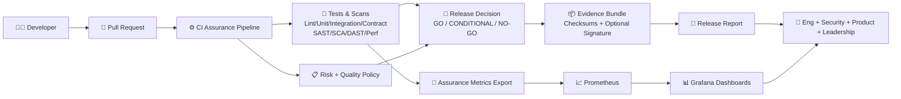

# 🛡️ Unified Assurance Platform (UAP)


> **One platform for quality gates, real test evidence, observability, and release decisions.**

Make releases predictable with a practical, policy-driven assurance system developers can actually use.

---

## ✨ Why this exists

Most teams have tests. Fewer teams have **trusted release decisions**.

UAP connects:
- ✅ test execution
- ✅ risk policy
- ✅ CI/CD gates
- ✅ evidence bundles
- ✅ Grafana visibility

So stakeholders get: **GO / CONDITIONAL / NO-GO** with traceable reasons.

---

## 🧭 What you get

- 📋 **Quality gates + risk model** (`policies/`)
- ⚙️ **Assurance runner** (`scripts/run-assurance.sh`)
- 🔎 **Real-tool mode** (k6, semgrep, trivy, ZAP; optional newman/playwright)
- 📦 **Evidence + report generation**
- 📈 **Autoprovisioned dashboards** (infra + assurance)
- 🧱 **Golden paths** for API/web/event/payments/auth + multi-module apps
- 🏭 **Enterprise CI/CD Phase 1** (PR/pre-release/post-deploy workflows)

---

## 🏗️ Platform architecture



---

## 🚀 Quick start

```bash
make bootstrap
make validate
make tooling-check
make run-assurance
make report RESULTS=artifacts/latest/results.json OUT=artifacts/latest/release-report.md
```

---

## 🎬 5-minute quick demo (GIF + walkthrough)

> Add your demo GIF at `docs/assets/uap-demo.gif` and it will render below.


No GIF yet? Run this walkthrough live:

```bash
make demo-e2e
```

Then show these screens in order:
1. `http://127.0.0.1:8790/demo/site/` → Happy vs Broken path toggle
2. `http://localhost:3000` → UAP Assurance Dashboard
3. `artifacts/latest/demo-e2e-report.md` → Final GO/NO-GO report

---

## 🔥 One-command live demo (golden path)

```bash
make demo-e2e
```

This will:
1. Start local observability stack
2. Start demo service + demo UI
3. Run real assurance flow
4. Export assurance metrics
5. Generate final report

### Open these after `make demo-e2e`
- 🌐 Demo UI: `http://127.0.0.1:8790/demo/site/` (auto-fallback to 8791/8792)
- 📊 Grafana: `http://localhost:3000`
- 📈 Prometheus: `http://localhost:9090`
- 📝 Final report: `artifacts/latest/demo-e2e-report.md`

Stop everything:
```bash
make demo-down && make demo-site-down && make dev-stack-down
```

---

## 📊 Dashboards (autoprovisioned)

In Grafana (`http://localhost:3000`):

- **UAP Local Observability Overview**
  - infra and collector health
- **UAP Assurance Dashboard**
  - release recommendation
  - test statuses
  - risk score/tier
  - policy validation
  - vulnerability and failure signals
  - trends over time (local persistence caveats apply)

---

## 🧪 Real tool mode

`make run-assurance` = pragmatic mode (graceful simulation where needed)

`make run-assurance-real` = force real tools:
- ⚡ k6
- 🔐 semgrep
- 🧬 trivy
- 🕷️ OWASP ZAP baseline
- 📮 optional newman
- 🎭 optional playwright

Run only ZAP smoke:
```bash
make zap-smoke
```

Useful env overrides:
```bash
TRIVY_SEVERITY=CRITICAL,HIGH TRIVY_EXIT_CODE=0 \
K6_VUS=2 K6_DURATION=5s PERF_TARGET_URL=https://test.k6.io \
ZAP_TARGET_URL=http://127.0.0.1:5678 ZAP_TIMEOUT_MIN=2 ZAP_FAIL_LEVEL=medium \
make run-assurance-real
```

---

## 🧱 Golden paths for multi-module apps

Use this for apps with `frontend`, `api`, `worker`, `shared-lib`, etc.

Generate module-specific golden paths:
```bash
make module-golden-path MODULE=checkout-ui TYPE=frontend
make module-golden-path MODULE=payments-api TYPE=api
```

Generated outputs:
- `docs/generated/checkout-ui.md`
- `docs/generated/payments-api.md`

Core references:
- `docs/golden-paths/multi-module-app.md`
- `templates/module-onboarding-template.md`
- `templates/module-assurance-profile.yaml`
- `templates/module-ci-template.yml`

---

## 🏢 Enterprise readiness (Phase 1 + Phase 2)

Included in repo:
- `.github/workflows/pr.yml`
- `.github/workflows/pre-release.yml`
- `.github/workflows/post-deploy.yml`
- `.github/workflows/reusable-assurance.yml`
- `config/promotion/{dev,stage,prod}.json`
- `policies/tiers/{low,medium,high,critical}.json`
- `config/exceptions/template.yaml`
- `config/control-ownership.json`
- `docs/compliance/control-traceability.md`
- `.github/CODEOWNERS`
- `scripts/evaluate-promotion.py`
- `scripts/validate-exceptions.py`
- `scripts/create-evidence-bundle.py`
- `scripts/sign-evidence-bundle.sh`

Setup docs:
- `docs/phase1-enterprise-cicd.md`
- `docs/phase2-enterprise-assurance-controls.md`
- `docs/branch-protection-guidance.md`

Phase 2 key commands:
```bash
make run-assurance-real
make validate-exceptions ENV=stage
make promotion-check ENV=stage
make report
```

---

## 🗂️ Repo map

- `docs/` → guides, architecture, golden paths
- `policies/` → quality gates + risk model
- `catalog/` → test catalog
- `config/` → promotion + module configs
- `ci/templates/` → CI templates
- `infra/local/` → local observability stack + provisioning
- `reporting/` → KPI/scorecard formats
- `scripts/` → assurance engine + helpers
- `templates/` → onboarding and governance templates

---

## 🤝 Contribution standard

For major design docs and stakeholder-facing reports:
- follow `docs/contribution-standard.md`
- include `templates/self-reflection-template.md`

---

## 🧠 Agentic-QE inspired alignment

- `docs/agentic-alignment-matrix.md`
- `docs/enterprise-hardening-backlog.md`

---

## ⚠️ macOS notes

- If Gatekeeper blocks tools (like ZAP), allow in **Privacy & Security** or install via Homebrew.
- For localhost scans in Dockerized ZAP path, use `host.docker.internal` where required.

---

Built for practical teams: **ship faster, break less, prove quality.** 🚀
