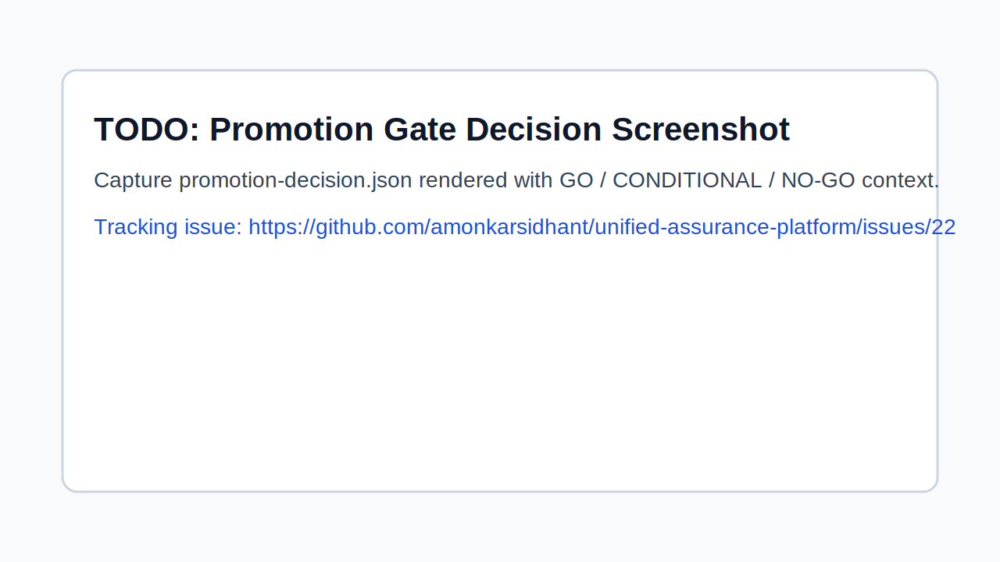

# Phase 2.5 (P0) gap closure

This document captures the P0 enterprise gap closure implementation.

## What was added

1. **Standardized results contract (`results.v2`)**
   - Schema: `schemas/results-v2.schema.json`
   - Normalizer: `scripts/normalize-results-v2.py`
   - Output (non-breaking): legacy `artifacts/latest/results.json` remains, new `artifacts/latest/results.v2.json` is added.

2. **PR feedback loop**
   - PR comment renderer: `scripts/render-pr-comment.py`
   - Workflow wiring:
     - `reusable-assurance.yml` generates `artifacts/latest/pr-comment.md`
     - `pr.yml` uploads `pr-comment-preview` artifact and attempts PR comment with `GITHUB_TOKEN` (best effort).

3. **Mandatory evidence integrity by tier**
   - `scripts/evaluate-promotion.py` enforces signature+attestation for required tiers (`high`, `critical` by default), configurable via promotion policy:
     - `signature_required_tiers`
     - `signature_fail_closed`
   - Missing integrity evidence is recorded in auditable fields (`audit_reasons`, `evidence_integrity`) and fails promotion when fail-closed.

4. **Flaky-test policy**
   - Policy: `config/flaky-policy.json`
   - Evaluator: `scripts/evaluate-flaky-policy.py`
   - Integrated into promotion decision (`flaky_policy`) and release report section.

## Capability snapshot


*Promotion gate decision screenshot placeholder. Reliable capture is tracked in issue [#22](https://github.com/amonkarsidhant/unified-assurance-platform/issues/22).*

## Verification commands

```bash
make validate
make run-assurance
make evaluate-flaky
make validate-exceptions ENV=stage
make promotion-check ENV=stage || true
make normalize-results-v2
make report RESULTS=artifacts/latest/results.json OUT=artifacts/latest/release-report.md
make render-pr-comment
```

## High/Critical signature fail-closed check (sample)

```bash
python3 scripts/evaluate-promotion.py \
  --environment stage \
  --results examples/phase2/promotion-results-high.json \
  --exceptions-dir config/exceptions \
  --flaky-result artifacts/latest/flaky-policy.json \
  --output artifacts/latest/promotion-decision.high-sample.json || true
cat artifacts/latest/promotion-decision.high-sample.json
```

Expected: failure includes `signature/attestation missing for required tier` when no valid `.sig` + `.cert` exist.

## Grafana mapping (artifact → metric → panel)

| Artifact source | Exported metric(s) | Governance dashboard panel |
|---|---|---|
| `promotion-decision.json` (`passed`) | `assurance_promotion_allowed` | Promotion Allowed |
| `promotion-decision.json` (`failures[]`) | `assurance_promotion_failed_gates_total`, `assurance_promotion_failed_gate{gate=...}` | Failed Gates (count/list) |
| `promotion-decision.json` (`evidence_integrity`) | `assurance_evidence_signature_required`, `assurance_evidence_signature_present`, `assurance_evidence_attestation_present`, `assurance_evidence_fail_closed` | Evidence Integrity |
| `exceptions-audit.json` (+ fallback `promotion-decision.json.exceptions_used`) | `assurance_exceptions_active_total`, `assurance_exceptions_expired_total`, `assurance_exceptions_violations_total` | Exceptions Active/Expired/Violations |
| `flaky-policy.json` (+ fallback `promotion-decision.json.flaky_policy`) | `assurance_flaky_violations_total`, `assurance_flaky_count`, `assurance_flaky_allowed` | Flaky Violations / Count / Allowed |
| `results.v2.json` or `promotion-decision.json` (`control_matrix`) | `assurance_control_required{control=...}`, `assurance_control_pass{control=...,status=...}` | Tier-required Controls Pass/Fail Matrix |
| `pr-comment.md` (fallback to results-derived counts) | `assurance_pr_summary_severity_total{severity=...}` | PR Summary Severity Signals |

## Notes

- Backward compatibility is preserved: existing scripts still consume `results.json`.
- New files are additive and can be adopted incrementally in downstream systems.
