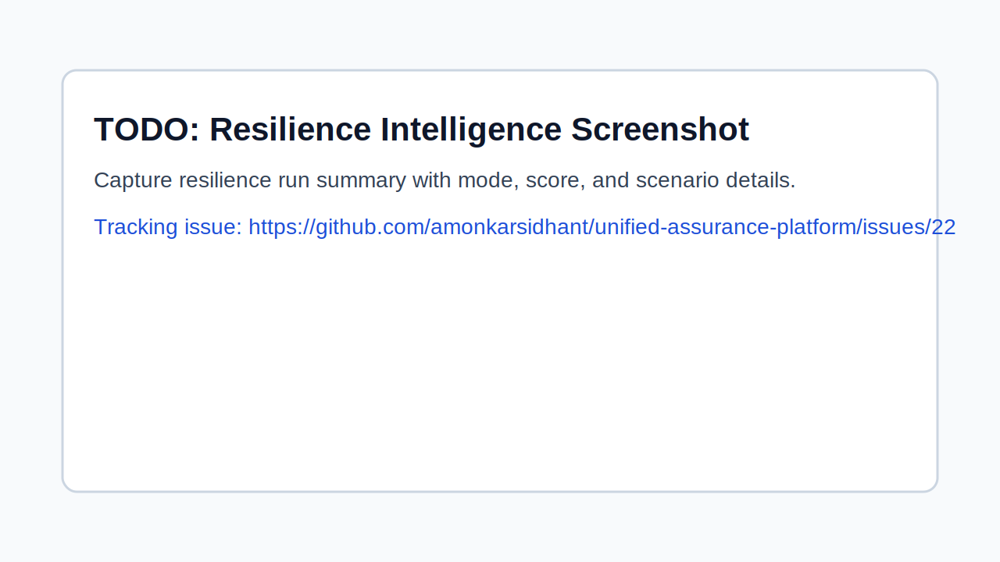

# Resilience Intelligence Platform — Phase 1 (MVP)

## What it does

Phase 1 introduces a practical resilience orchestration step that combines:
- load path execution (k6-first, graceful skip)
- chaos/resilience path execution (`scripts/run-chaos-checks.sh`)
- shared summary output for assurance, metrics, and dashboards

The orchestrator is `scripts/run-resilience-intelligence.sh`.

## Modes

- `ROBUSTNESS` (default): deterministic fixed profile
- `CHAOS`: randomized parameters from seed

Config defaults are in `config/resilience-intelligence.json`.

Scenario examples:
- `templates/scenarios/resilience/robustness-fixed.json`
- `templates/scenarios/resilience/chaos-randomized.json`

## How to run

```bash
make resilience-intelligence
make resilience-intelligence-check
```

Or directly:

```bash
RESILIENCE_INTELLIGENCE_MODE=CHAOS ./scripts/run-resilience-intelligence.sh
```

`make run-assurance` now also executes this step and writes status under `tests.resilience_intelligence` in `artifacts/latest/results.json`.

## Capability snapshot


*Resilience intelligence screenshot placeholder. Reliable capture is tracked in issue [#22](https://github.com/amonkarsidhant/unified-assurance-platform/issues/22).*

## Artifacts

Generated under `artifacts/latest/`:
- `resilience_intelligence.status`
- `resilience_intelligence.log`
- `resilience-intelligence.json`

Summary (`resilience-intelligence.json`) includes:
- mode, status, score
- selected run parameters (vus, duration, fault profile)
- load and chaos sub-step statuses + reasons

## Known skips (explicit)

- `k6 not installed` or `tests/perf/smoke.js missing`
- `chaos script not found`
- both skipped => overall `skipped`

Failures are explicit in summary reasons and orchestrator exit code.

## Phase 1 boundary (what’s intentionally not in scope)

- No deep redesign of existing chaos engine
- No advanced multi-target topology scheduling
- No hard policy break on low/medium tiers
- High/critical promotion path observes resilience intelligence status in rationale (`phase1-observe-only`)

Phase 2 can harden policy enforcement, richer scoring, and expanded experiment catalogs.
