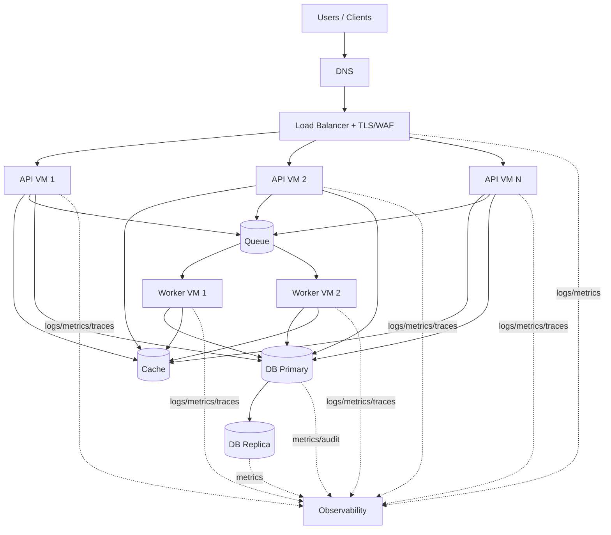

# Reference Architecture Diagram

## Text view
- Clients hit a public LB.
- LB routes requests to API VM pool.
- API reads/writes primary DB; read-heavy calls may use replica.
- API publishes async work to queue.
- Worker VMs consume queue, update DB/cache, emit events.
- Cache serves hot reads and reduces DB load.
- All components emit logs/metrics/traces to observability stack.

## Mermaid

