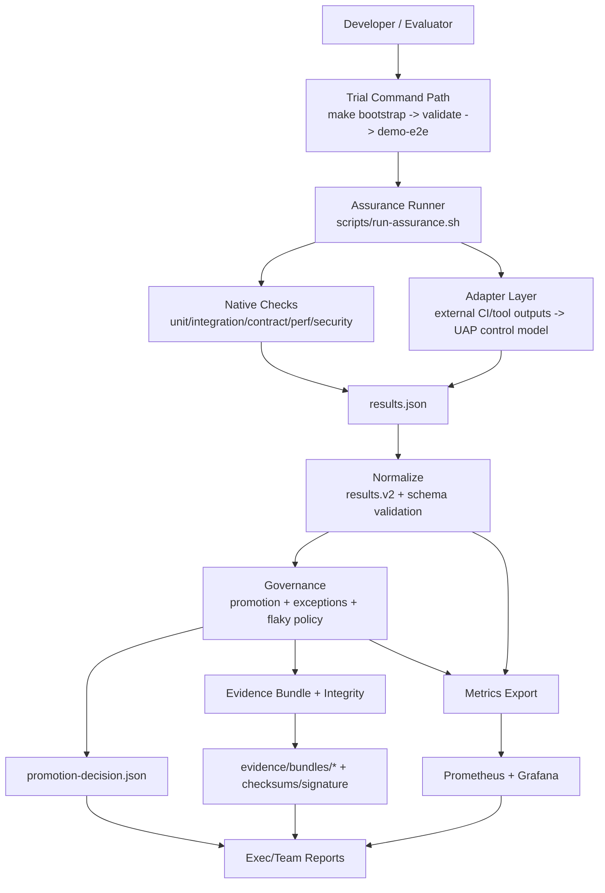

# Platform Trial Pack architecture (next 2 weeks)

## Purpose
Define how the three outcomes—trial environment, integration adapters, and guardrailed golden path—fit the current UAP repository components.

## Current components to reuse
- Orchestration: `Makefile`, `scripts/run-assurance.sh`, `scripts/tooling-check.sh`
- Governance decisions: `scripts/evaluate-promotion.py`, `scripts/validate-exceptions.py`, `config/promotion/*.json`, `policies/tiers/*.json`
- Normalized contract: `scripts/normalize-results-v2.py`, `schemas/results-v2.schema.json`, `artifacts/latest/results.v2.json`
- Evidence integrity: `scripts/create-evidence-bundle.py`, `scripts/sign-evidence-bundle.sh`, `evidence/bundles/`
- Observability: `scripts/export-assurance-metrics.py`, `artifacts/metrics/assurance.prom`, `infra/local/docker-compose.yml`
- Demo and walkthroughs: `make demo-e2e`, `docs/demo-walkthrough.md`, `demo/`

## Target architecture (trial pack)

## How each focus area maps to repository

### 1) 10-minute demo/trial environment
**Primary path**
- `make bootstrap`
- `make validate`
- `make demo-e2e`

**Supporting components**
- Local stack: `infra/local/docker-compose.yml`
- Demo service/UI: `demo/docker-compose.yml`, `demo/site/*`
- Reports/artifacts: `artifacts/latest/*`

**Required hardening in this sprint**
- Deterministic readiness checks for demo and observability stack.
- Clear “trial success” artifact checklist.
- Operator-facing troubleshooting links.

### 2) Bring-your-stack integration layer
**Architecture pattern**
- Introduce adapter contract that transforms external outputs into UAP check records before normalization.
- Keep policy engine unchanged; adapters only map data shape + control identity.

**Contract boundaries**
- Input: CI/scanner/test/observability tool outputs (JSON/log/API).
- Transform: adapter maps to canonical check fields (control_id, status, severity, evidence pointers, timestamps).
- Output: compatible with `results.json` -> `results.v2` normalization path.

**Validation boundary**
- Adapter output validated against schema and minimal governance preconditions before promotion evaluation.

### 3) Golden path with guardrails
**Policy tiers**
- Driven by `policies/tiers/{low,medium,high,critical}.json` and promotion config.
- Enforcement via `scripts/evaluate-promotion.py`.

**Exceptions**
- Request format anchored on `config/exceptions/template.yaml`.
- Validation/audit via `scripts/validate-exceptions.py` -> `artifacts/latest/exceptions-audit.json`.

**Evidence integrity**
- Bundle + hash/signature workflow remains source of truth.
- Tier-based fail-closed behavior for high/critical must be explicit and testable.

## Extension points (adapters/contracts)

### Extension point A: Adapter interface
Each adapter must provide:
- Source metadata (tool name/version, run id, environment)
- Control mapping table (external check -> UAP control ID)
- Status mapping (`pass|fail|warn|skip`)
- Severity mapping (`critical|high|medium|low|info`)
- Evidence references (artifact path/URL, digest when available)

### Extension point B: Control ownership alignment
- Adapter-produced control IDs must resolve against `config/control-ownership.json`.
- Unknown control IDs should fail validation (or explicitly warn in non-blocking mode during rollout).

### Extension point C: Normalization contract
- Adapter output must be ingestible by `scripts/normalize-results-v2.py`.
- `schemas/results-v2.schema.json` remains canonical downstream contract.

### Extension point D: Governance toggles by environment
- Promotion behavior remains environment-scoped through `config/promotion/{dev,stage,prod}.json`.
- Adapter intake should not bypass env-specific gating semantics.

## Data flow and integrity guarantees
1. Raw execution/adapted signals collected under `artifacts/latest/`.
2. Normalize to `results.v2` for stable downstream consumption.
3. Evaluate promotions + exceptions with tier rules.
4. Create/sign evidence bundle for auditability.
5. Export metrics for operational visibility; artifacts remain source-of-truth details.

## Operational constraints
- Keep local-first execution model (no mandatory external control plane).
- Support graceful degradation when optional tools are missing, but never silently bypass mandatory high/critical controls.
- Prefer additive changes around scripts/configs already in repo.

## Implementation guardrails for the 2-week pack
- No breaking changes to existing `make run-assurance` path.
- New integration logic must be isolated in adapters/contracts, not embedded into policy decision code.
- Every guardrail change must produce observable output in artifacts and (where applicable) exported metrics.
