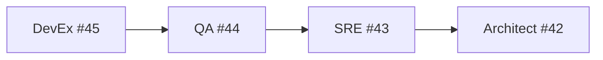

# PR-B Phase-2 Sequencing & Acceptance Map

**Source:** Issue #41  
**Context:** Epic #31 - Agent Team Operating Model in GitHub  
**Approach:** Safe-first -> Ambitious

---

## 1. DevEx Metrics Baseline (DevEx)

**Issue:** #45  
**Owner:** DevEx Team  
**Sequence:** 1 (Foundation)

### DevEx Tasks

- [ ] Capture baseline metrics (TTFG, failure-to-fix, PR cycle time)
- [ ] Implement failure-summary UX improvements
- [ ] Define low-risk implementation order for subsequent items

### DevEx Acceptance Criteria

- Metrics baseline committed to repo
- Follow-up targets published
- Dashboard/table showing current vs target metrics

---

## 2. QA Evidence Traceability (QA)

**Issue:** #44  
**Owner:** QA Team  
**Sequence:** 2 (Builds on DevEx)

### QA Tasks

- [ ] Update QA evidence matrix
- [ ] Define minimum merge gate checklist
- [ ] Align failure triage protocol with DevEx metrics

### QA Acceptance Criteria

- PRs include complete traceability (requirement -> evidence)
- Objective merge evidence checklist enforced
- Linkage to DevEx metrics baseline established

---

## 3. SRE Reliability Safeguards (SRE)

**Issue:** #43  
**Owner:** SRE Team  
**Sequence:** 3 (Builds on QA)

### SRE Tasks

- [ ] Define canary/safe-first rollout guardrails
- [ ] Set explicit rollback thresholds
- [ ] Create reliability evidence checklist

### SRE Acceptance Criteria

- Reliability criteria referenced by PR merge checks
- Runbooks updated with rollback triggers
- Integration with QA evidence matrix verified

---

## 4. Architect Guardrail Enforcement (Architect)

**Issue:** #42  
**Owner:** Architect Team  
**Sequence:** 4 (Builds on SRE)

### Architect Tasks

- [ ] Document guardrail checks/constraints for phase-2 items
- [ ] Handle approved deviations (if any)
- [ ] Create architecture risk notes and mitigations

### Architect Acceptance Criteria

- Constraints documented and cross-linked to active PRs
- Deviation handling process defined
- Risk mitigation plan reviewed and approved

---

## Dependencies

## Definition of Done (Overall)

- [ ] All 4 issues linked to execution PRs
- [ ] Sequential order respected (no parallel blocking dependencies)
- [ ] Cross-team review completed for each transition
